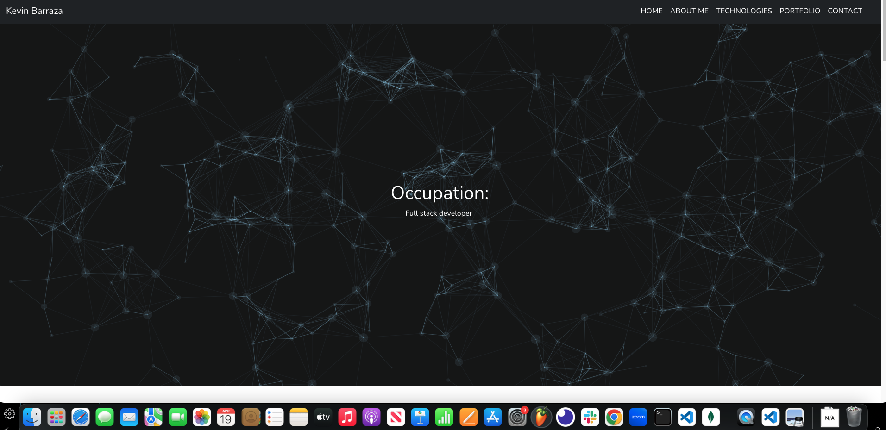

## Develop20-REACT

Welcome to my portfolio applictaion built with React.

## Description:
This React-based application has been crafted using the latest development practices to provide a polished portfolio. The use of CSS ensures a seamless user experience.

## Installation:
Before utilizing this application, it is important to ensure that the necessary dependencies have been installed. Please begin by cloning the repository, followed by running 'node i' to install these dependencies.

## Usage:
To launch the application, the user must initiate 'npm start' in the terminal. Once launched, the application allows the user to input their desired information, thereby enabling easy customization of the database.

## Contributors:
This application was created by Kevin Barraza.

## Questions:
For any inquiries, please refer to my GitHub page at https://github.com/eskevin14th. I will be happy to respond to any questions you may have.

